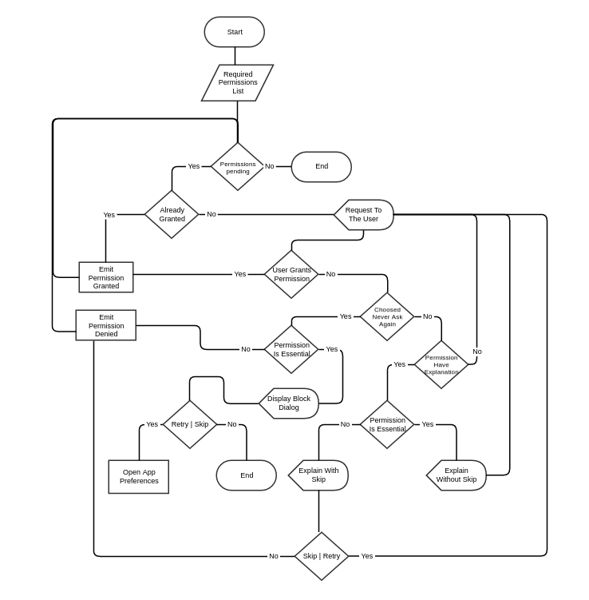

# Reactive Permissions

[](https://www.apache.org/licenses/LICENSE-2.0)
[](https://bintray.com/maxcruz/maven/reactive-permissions)

Deal with Android M permissions in runtime in a simple way with reactive programming. This library was developed in __Kotlin__ but can [interoperate](https://kotlinlang.org/docs/reference/java-to-kotlin-interop.html) with Java.

### Flow

User Request Permissions



### Example 

View an example in a simple activity [here](https://github.com/MaxCruz/reactive_permissions/tree/master/sample)

[IMAGE GIF GO HERE]

### Setup

Configure the repository with maven
```gradle
maven { url "https://dl.bintray.com/maxcruz/maven" }
```

Add this to the gradle dependencies for your module
```gradle
compile 'com.github.maxcruz:reactive-permissions:1.0'
```
### Usage for Kotlin, [for Java implementation] (./README-Java.md)

Define permissions as needed:
```kotlin
val camera = Permission(
        Manifest.permission.CAMERA, // Permission constant to request
        R.string.rationale_camera, // String resource with rationale explanation
        true // Define if the app can continue without the permission
)

val location = Permission(
        Manifest.permission.ACCESS_FINE_LOCATION,
        R.string.rationale_location,
        false // If the user deny this permission, block the app
)


val contacts = Permission(
        Manifest.permission.READ_CONTACTS,
        null, // The context is clear and isn't needed explanation for this permission
        true
)

// Put all permissions to evaluate in a single array 
val permissions = listOf(location, camera, contacts)
```

Create the library object for the request
```kotlin
// Define a code to request the permissions
private val REQUEST_CODE = 10
// Instantiate the library
val reactive: ReactivePermissions = ReactivePermissions(this, REQUEST_CODE)
```

Subscribe to observe results __Pair&lt;String, Boolean&gt;__
```kotlin
reactive.observeResultPermissions().subscribe { event ->
    if (event.second) {
        Toast.makeText(this, "${event.first} GRANTED :-)", Toast.LENGTH_SHORT).show()
    } else {
        Toast.makeText(this, "${event.first} DENIED :-(", Toast.LENGTH_SHORT).show()
    }
}
```

Evaluate the defined permissions. Call __evaluate__ after of register the observer
```kotlin
reactivePermissions.evaluate(permissions)
```

In the activity, receive the response from the user and pass to the lib
```kotlin
override fun onRequestPermissionsResult(code: Int, permissions: Array<String>, results: IntArray) {
        if (code == REQUEST_CODE)
                reactive.receive(permissions, results)
}
```
